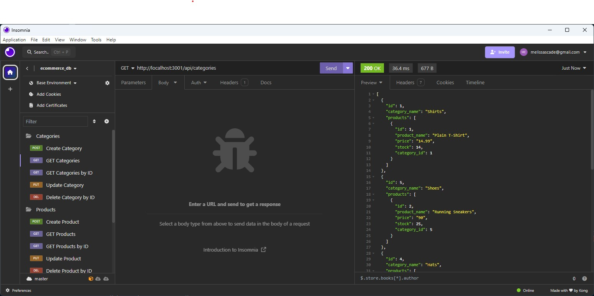
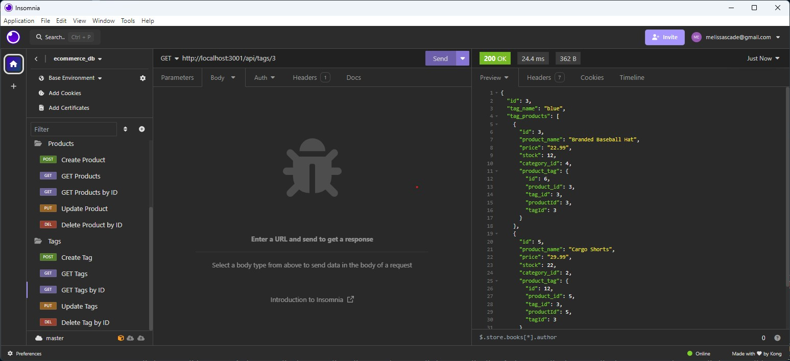
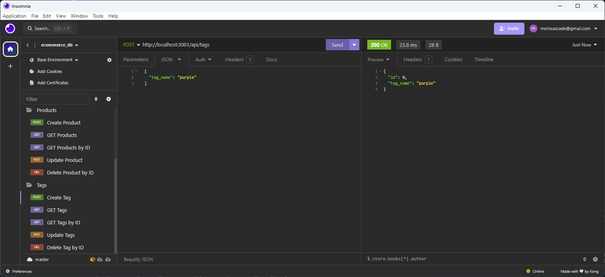
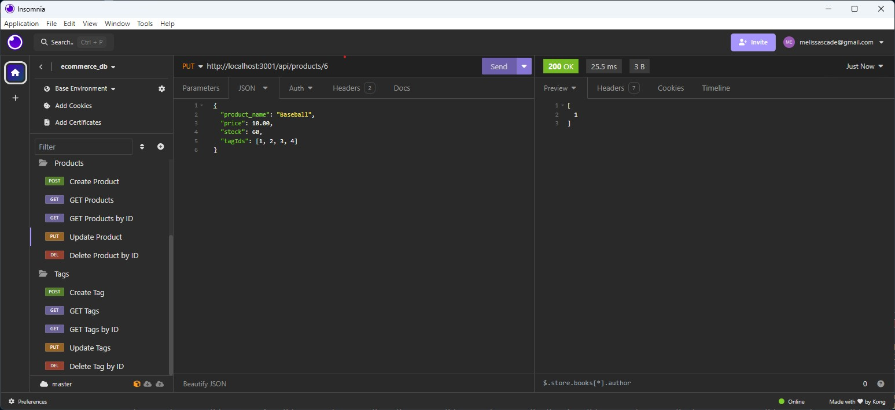
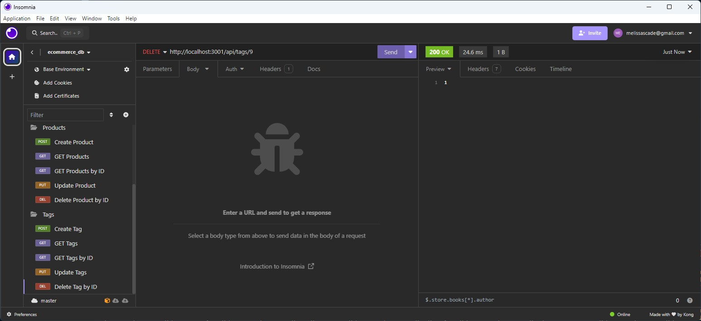

# e-commerce-backend

Building a back end for a typical e-commerce site.

## Description

This project focuses on back-end route development for CRUD operations such as "GET", "POST", "PUT", and "DELETE" in a typical e-commerce site.

## Demonstrations

Part 1 shows the creation of the database, creation and seeding of the tables, and turning on the server.

https://github.com/MelissaCade/e-commerce-backend/assets/160056156/37a03837-74da-4cd9-839c-041478ca6f79

Part 2 shows the different routes in Insomnia.

https://github.com/MelissaCade/e-commerce-backend/assets/160056156/890f01bd-100c-4b38-93bc-1b50dd848a04

## Screenshots

Screenshots of each operation for each model are included in the assets/screenshots folder in this github repository, for additional reference.

## Installation

Navigate to the project directory and use "npm i" in your terminal to install all necessary node packages.

To create your database, type "psql -U postgres" in your terminal, then type "\i db/schema.sql", then "\q" to exit the postgres shell.

To seed your database, type "npm run seed" in your terminal.

## Usage

User can navigate to their Insomnia app to test route functionality.

When testing the "POST" and "PUT" functions, the JSON body of your req.params should look like this for the various models:

Categories:

{
"category_name": "socks"
}

Products:

{
"product_name": "Basketball",
"price": 20.00,
"stock": 30,
"tagIds": [1, 2, 3, 4]
}

Tags:

{
"tag_name": "purple"
}

## Links

GitHub repository: https://github.com/MelissaCade/e-commerce-backend

## Credits

This page uses the materials and resources provided in the University of Denver Coding Bootcamp.

I also used the following websites as reference to figure out how to do everything:

stack overflow - https://stackoverflow.com/  
free code camp - https://www.freecodecamp.org/  
geeks for geeks - https://www.geeksforgeeks.org/  
mdn web docs - https://developer.mozilla.org/en-US/  
w3schools - https://www.w3schools.com/
sequelize - https://sequelize.org/
